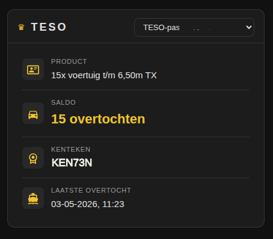
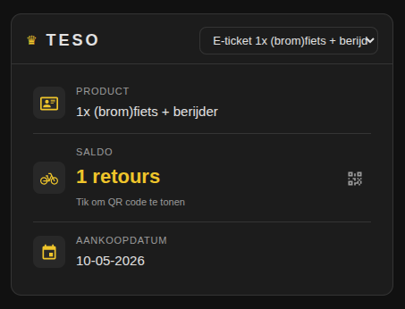
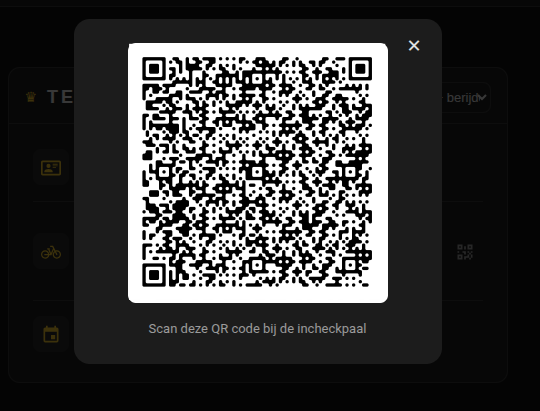

# TESO Veerboot - Home Assistant Integratie

Volgt het aantal resterende overtochten op je TESO-passen en e-tickets via het Mijn TESO portaal.

## Functies

- **Resterende overtochten** per pas of e-ticket
- **Gekoppeld kenteken** per pas
- **Laatste overtocht** datum en tijd
- Automatisch verversen elke 5 minuten
- Apparaatstructuur per TESO-pas / Ticket

## Installatie

### Handmatig

1. Kopieer de map `custom_components/teso/` naar je Home Assistant `custom_components/` map.
2. Herstart Home Assistant.
3. Ga naar **Instellingen → Apparaten & Diensten → Integratie toevoegen**.
4. Zoek op **TESO** en volg de stappen.

### Via HACS

1. Voeg `https://github.com/nielsbooij/ha-teso` toe als aangepaste repository in HACS.
2. Installeer de **TESO Veerboot** integratie.
3. Herstart Home Assistant.
4. Ga naar **Instellingen → Apparaten & Diensten → Integratie toevoegen**.
5. Zoek op **TESO** en volg de stappen.

## Sensoren

Per pas worden de volgende sensoren aangemaakt:

| Sensor | Beschrijving |
|--------|-------------|
| Resterende overtochten | Aantal resterende overtochten per product |
| Gekoppeld kenteken | Het aan de pas gekoppelde kenteken |
| Laatste overtocht | Datum en tijd van de laatste overtocht |

Per e-ticket word de volgende sensor aangemaakt

| Sensor | Beschrijving |
|--------|-------------|
| Resterende overtochten | Aantal resterende overtochten per product |

## Gebruik in automatiseringen

Stuur een melding als je nog maar 2 overtochten over hebt:

```yaml
automation:
  - alias: "TESO bijna op"
    trigger:
      - platform: numeric_state
        entity_id: sensor.teso_pas_2514921229_resterende_overtochten
        below: 3
    action:
      - service: notify.mobile_app
        data:
          message: "Let op: je hebt nog maar {{ states('sensor.teso_pas_2514921229_resterende_overtochten') }} TESO overtochten!"
```


## Custom teso card
Er is bij deze integratie ook een custom lovelace card. 
die is beschikbaar via `https://github.com/nielsbooij/ha-teso-card` In de readme van de kaart wordt beschreven hoe je deze toevoegd. 
```



